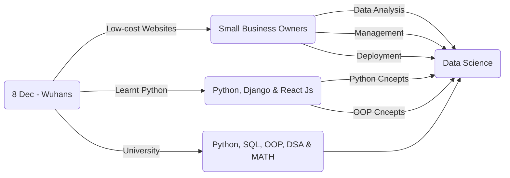

<h1 align="center"></h1>
<h3 align="center">Machine Learning - Backend - DevOps - Islamabad PK</h3>

[](https://www.linkedin.com/in/fasih4444) [](mailto:arainfaisal@gmail.com) 
<p align="left"> <a href="https://twitter.com/fasih4444" target="blank"></a> </p>

 ## Who am I?
 ```python
 class WhoAmI:
 	user = 'Faisal Fida'
	current_edu = "BS Computer Science @ COMSATS"
	hobbies = [
				'Watching Anime',
				'Being up all Night chasing that ONE BUG...'
			]
	
	def getCity():
		return Wah_Cantt_Pakistan()
	
	def Ambitions():
		Attain_Solitude()
		Known_After_Death()
		Wanna_Be_In_StrangerThings()
		# Assume 10 more awesome ambitions here  ;)
 ```
 
 ---


#### intro
From Pakistan
18 Years Old
Google Call me (fasih4444)

I do stuff with python such as letting an AI Model tell you how you feel on the basis of your text input and make cute charts using Pandas Library. Sometimes I even let an AI Model tell you if you are a cat or a human.

#### progress:
 - [ ] Math
	 - [x] Linear Algebra & Calculus 
	 - [ ] Statistics & Probability
 - [x] Pre-processing
	 - [x] Data Cleaning
	 - [x] Data Integration
	 - [ ] Data Transformation
	 - [x] Data Reduction
 - [ ] Model Building & Visualization
	 - [ ] Exploratory Data Analysis
	 - [ ] Feature Selection
	 - [x] Testing 
	 - [x] Deploying
 - [x] Machine Learning Algorithms & Github Open Source


#### education: 

 - [ ] MS(Data science)-2026 
 - [ ] BS(Computer Science)-2024

I am extremely passionate about working for the corporate/organisation where I can prove myself I am the best. 

#### journey:

And that was the moment, that I fell into the Rabbit Hole and here I am. www.github.com/fasih4444 


### A little about me...   
I'm an **Undergrad Student🎓 [@Comsats](https://cuiwah.edu.pk)** pursuing BS CS. I'm a **Tech Enthusiast 💻 😃** passionate about learning and working with new tech. I love building interesting and amazing products that serve a great deal of purpose. <br/><br/>

---

## ⚡️ A Few Quick Facts

- 🔭 I’m currently working on some NLP Projects.
- 🌱 I’m currently learning Java (But Love Python😅) ☕


- I enjoy working on
  - 📊 Machine Learning & Data Science
  - 🖼 Computer Vision
  - 🛠 DIY Raspberry Pi Projects
  - 🤖 Robotics
- 📝 I write technical blogs and articles
- 💬 Ask me about Python, ML, CV, Raspi

- 📝 I regularly write articles on [https://medium.com/@fasih4444_](https://medium.com/@fasih4444_)

- ⚡ Fun fact: Astrophysics and SpaceX🚀 
-  👉 Watch a lot Sci-Fi Movies & bit.ly/heart-miner


<h3 align="left">Connect with me:</h3>
<p align="left">
<a href="https://dev.to/fasih4444" target="blank"></a>
<a href="https://twitter.com/fasih4444" target="blank"></a>
<a href="https://linkedin.com/in/fasih4444" target="blank"></a>
<a href="https://stackoverflow.com/users/18847645" target="blank"></a>
<a href="https://kaggle.com/fasih4444" target="blank"></a>
<a href="https://fb.com/fasih4444" target="blank"></a>
<a href="https://instagram.com/fasih4444" target="blank"></a>
<a href="https://medium.com/@fasih4444" target="blank"></a>
</p>

---

## My Skill Set  
<table><tr><td valign="top" width="33%">

### Machine Learning  
<div align="center">  
<a href="https://opencv.org/" target="_blank"></a>  
<a href="https://pytorch.org/" target="_blank"></a>  
<a href="https://www.tensorflow.org/" target="_blank"></a>  
<a href="https://keras.io/" target="_blank"></a>  
<a href="https://www.python.org/" target="_blank"></a>  
  </div>
  
</div></td><td valign="top" width="33%">


### Backend  
<div align="center">  
<a href="https://www.php.net/" target="_blank"></a>  
<a href="https://www.mongodb.com/" target="_blank"></a>  
<a href="https://www.linux.org/" target="_blank"></a>  
<a href="https://www.nginx.com/" target="_blank"></a>  
<a href="https://github.com/" target="_blank"></a>  
<a href="https://www.gnu.org/software/bash/" target="_blank"></a>  
<a href="https://www.mysql.com/" target="_blank"></a>  
<a href="https://www.djangoproject.com/" target="_blank"></a>  
<a href="https://flask.palletsprojects.com/" target="_blank"></a>  
<a href="https://firebase.google.com/" target="_blank"></a>  
</div>  


</div></td><td valign="top" width="33%">
  
### DevOps  
<div align="center">  
<a href="https://azure.microsoft.com/en-in/" target="_blank"></a>  
<a href="https://www.nginx.com/" target="_blank"></a>  
<a href="https://kubernetes.io/" target="_blank"></a>  
<a href="https://www.docker.com/" target="_blank"></a>
<a href="https://github.com/" target="_blank"></a>  
</div>
</div></td></tr></table> 


---

<p></p>

<div align="center"> [](https://medium.com/@fasih4444_)</div>

### A Famous Fact/Quote:
<a href="https://github.com/marketplace/actions/quote-readme">
<!--STARTS_HERE_QUOTE_README-->
• <i>“In a software project team of 10, there are probably 3 people who produce enough defects to make them net negative producers.”— Gordon Schulmeyer   </i>
<!--ENDS_HERE_QUOTE_README-->
</a>
